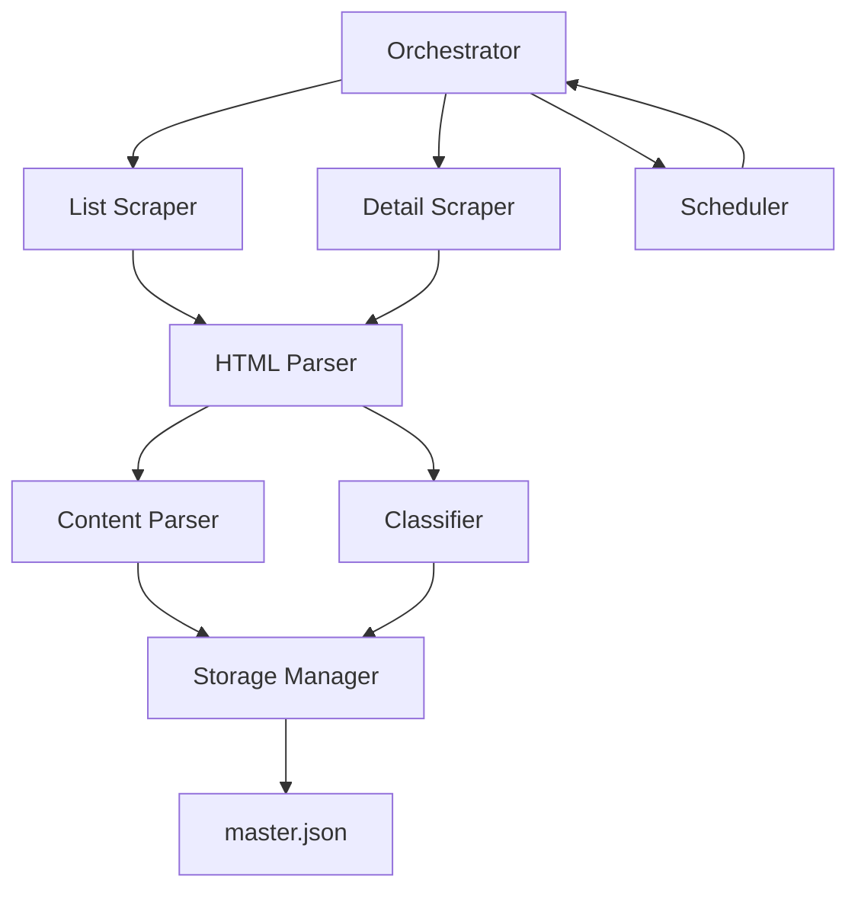

# Design Document

## Overview

The Railway News Monitor is a Python-based web scraping and monitoring system designed for academic research. It automatically tracks Taiwan Railway Administration (TRA) announcements, detecting service disruptions and analyzing how crisis communications evolve over time. The system operates in two modes: an initial historical scrape to build a baseline dataset, and continuous monitoring to capture real-time updates and content modifications.

The architecture emphasizes modularity, reliability, and research-grade data quality. Each component has a single, well-defined responsibility, making the system maintainable and extensible for future research needs.

## Steering Document Alignment

### Technical Standards (tech.md)

No existing steering documents. This design establishes the following technical standards:
- **Language**: Python 3.10+ for mature library ecosystem and type hints
- **Code Style**: PEP 8 compliance, enforced via `black` formatter and `flake8` linter
- **Type Safety**: Type hints throughout, validated with `mypy`
- **Error Handling**: Explicit exception handling with structured logging
- **Testing**: pytest framework with minimum 80% coverage target

### Project Structure (structure.md)

No existing structure document. This design proposes:

```
railway-news-monitor/
├── src/
│   ├── scrapers/          # Web scraping components
│   ├── parsers/           # Content extraction logic
│   ├── classifiers/       # Classification logic
│   ├── storage/           # Data persistence
│   └── orchestrator/      # Main execution control
├── config/                # Configuration files
├── data/                  # Output data (master.json)
├── logs/                  # Application logs
├── tests/                 # Test suite
└── requirements.txt       # Python dependencies
```

## Code Reuse Analysis

### Existing Components to Leverage

This is a greenfield project with no existing codebase. However, we will leverage mature open-source libraries:

- **requests**: HTTP client for web scraping with built-in retry logic
- **BeautifulSoup4 + lxml**: HTML parsing with robust error handling
- **APScheduler**: Job scheduling for monitoring mode
- **pydantic**: Data validation and settings management
- **loguru**: Structured logging with rotation

### Integration Points

- **File System**: `master.json` will be the single source of truth, stored in the `data/` directory
- **External API**: TRA website (read-only, no authentication required)
- **Future Extensions**: Design allows for future export to databases (PostgreSQL, SQLite) or cloud storage

## Architecture

The system follows a **pipeline architecture** with clear separation of concerns:

1. **Scraper Layer**: Fetches raw HTML from TRA website
2. **Parser Layer**: Extracts structured data from HTML
3. **Classifier Layer**: Tags announcements by category
4. **Storage Layer**: Persists data to JSON with atomic writes
5. **Orchestrator Layer**: Coordinates execution and scheduling

### Modular Design Principles

- **Single File Responsibility**: Each module handles one domain (e.g., `list_scraper.py`, `content_parser.py`)
- **Component Isolation**: Scrapers don't know about storage; parsers don't know about scheduling
- **Service Layer Separation**: Business logic (classification, extraction) separated from I/O (scraping, storage)
- **Utility Modularity**: Shared utilities (hash computation, date parsing) in dedicated modules



## Components and Interfaces

### Component 1: List Scraper (`scrapers/list_scraper.py`)

- **Purpose**: Fetches announcement list pages from TRA website
- **Interfaces**:
  - `scrape_page(page_num: int) -> List[AnnouncementListItem]`
  - `scrape_all_pages() -> List[AnnouncementListItem]`
- **Dependencies**: `requests`, `BeautifulSoup4`
- **Reuses**: Standard library `urllib.parse` for URL construction
- **Error Handling**: Retries (3x with exponential backoff), logs failures, continues on error

### Component 2: Detail Scraper (`scrapers/detail_scraper.py`)

- **Purpose**: Fetches individual announcement detail pages
- **Interfaces**:
  - `scrape_detail(detail_url: str) -> DetailPageContent`
  - `compute_hash(html: str) -> str`
- **Dependencies**: `requests`, `hashlib`
- **Reuses**: Shared `HTTPClient` utility for consistent request handling
- **Error Handling**: Network timeout (30s), malformed HTML detection, retry logic

### Component 3: Content Parser (`parsers/content_parser.py`)

- **Purpose**: Extracts structured data from HTML using regex and keyword matching
- **Interfaces**:
  - `parse(html: str) -> ExtractedData`
  - `extract_report_version(html: str) -> Optional[str]`
  - `extract_predicted_time(html: str) -> Optional[datetime]`
  - `extract_affected_lines(html: str) -> List[str]`
- **Dependencies**: `re`, `dateparser`, `BeautifulSoup4`
- **Reuses**: Shared `RegexPatterns` configuration class
- **Error Handling**: Returns `None` for failed extractions, logs parsing errors

### Component 4: Classifier (`classifiers/announcement_classifier.py`)

- **Purpose**: Categorizes announcements using keyword matching
- **Interfaces**:
  - `classify(title: str, content: str) -> Classification`
  - `extract_event_group_id(title: str, publish_date: str) -> str`
- **Dependencies**: `re`, `config/keywords.yaml`
- **Reuses**: Shared keyword configuration loaded at startup
- **Error Handling**: Defaults to `"General_Operation"` category if no match

### Component 5: Storage Manager (`storage/json_storage.py`)

- **Purpose**: Manages atomic read/write operations to master.json
- **Interfaces**:
  - `load() -> List[Announcement]`
  - `save(data: List[Announcement]) -> None`
  - `append_version(news_no: str, version: VersionEntry) -> None`
  - `add_announcement(announcement: Announcement) -> None`
- **Dependencies**: `json`, `filelock`
- **Reuses**: `pydantic` models for data validation
- **Error Handling**: File locking prevents corruption, backup on write failure

### Component 6: Orchestrator (`orchestrator/main.py`)

- **Purpose**: Coordinates historical scrape and monitoring workflows
- **Interfaces**:
  - `run_historical_scrape() -> None`
  - `run_monitoring_cycle() -> None`
  - `start_monitoring(interval_minutes: int) -> None`
- **Dependencies**: All other components, `APScheduler`
- **Reuses**: Configuration from `config/settings.py`
- **Error Handling**: Catches all exceptions, logs to file, continues operation

## Data Models

### AnnouncementListItem

```python
from pydantic import BaseModel

class AnnouncementListItem(BaseModel):
    news_no: str           # Unique ID from URL
    title: str             # Announcement title
    publish_date: str      # Format: "YYYY/MM/DD"
    detail_url: str        # Full URL to detail page
```

### ExtractedData

```python
from typing import Optional, List
from pydantic import BaseModel
from datetime import datetime

class ExtractedData(BaseModel):
    report_version: Optional[str] = None          # "1", "2", "第3發"
    event_type: Optional[str] = None              # "Typhoon", "Heavy_Rain", etc.
    status: Optional[str] = None                  # "Suspended", "Partial_Operation", etc.
    affected_lines: List[str] = []                # ["西部幹線", "東部幹線"]
    affected_stations: List[str] = []             # ["二水", "林內"]
    predicted_resumption_time: Optional[datetime] = None  # ISO 8601
    actual_resumption_time: Optional[datetime] = None     # ISO 8601
```

### Classification

```python
class Classification(BaseModel):
    category: str                  # "Disruption_Suspension", "Disruption_Update", etc.
    keywords: List[str]            # Matched keywords
    event_group_id: str            # "20251021_Pingxi_Rain"
```

### VersionEntry

```python
class VersionEntry(BaseModel):
    scraped_at: datetime           # ISO 8601 format
    content_html: str              # Raw HTML content
    content_hash: str              # "md5:a1b2c3d4..."
    extracted_data: Optional[ExtractedData] = None
```

### Announcement

```python
class Announcement(BaseModel):
    id: str                        # Same as news_no
    title: str
    publish_date: str
    detail_url: str
    classification: Classification
    version_history: List[VersionEntry]
```

## Error Handling

### Error Scenarios

1. **Network Timeout/Connection Error**
   - **Handling**: Retry 3 times with exponential backoff (1s, 2s, 4s). Log error if all retries fail. Skip announcement and continue.
   - **User Impact**: Logged as warning. Missing announcements flagged in summary report.

2. **Malformed HTML/Parsing Error**
   - **Handling**: Log error with announcement ID. Set `extracted_data = None`. Continue processing.
   - **User Impact**: Announcement stored with raw HTML but no structured data. Researcher can manually review.

3. **JSON Write Failure**
   - **Handling**: Create timestamped backup of current `master.json`. Attempt write again. If fails, halt execution.
   - **User Impact**: System stops to prevent data loss. Admin must resolve disk/permission issue.

4. **Hash Collision (unlikely)**
   - **Handling**: Log warning. Treat as content change to be safe (false positive).
   - **User Impact**: Extra version recorded. Better than missing a real change.

5. **Regex Extraction Failure**
   - **Handling**: Return `None` for that specific field. Log at DEBUG level (not an error).
   - **User Impact**: Field appears as `null` in JSON. Expected for non-disruption announcements.

6. **Rate Limiting by TRA Server**
   - **Handling**: Respect `Retry-After` header if present. Otherwise, exponential backoff up to 60s.
   - **User Impact**: Scraping slows down but completes successfully.

## Testing Strategy

### Unit Testing

- **Approach**: pytest with fixtures for HTML samples
- **Key components to test**:
  - `content_parser.py`: Test all extraction functions with real TRA HTML samples
  - `announcement_classifier.py`: Test keyword matching with edge cases
  - `json_storage.py`: Test atomic writes, concurrent access with file locking
  - `detail_scraper.py`: Test hash computation consistency

**Sample Tests**:
```python
def test_extract_predicted_time_typical():
    html = "<p>預計於今日19:00恢復行駛</p>"
    result = extract_predicted_time(html)
    assert result.hour == 19
    assert result.minute == 0

def test_classify_disruption():
    title = "平溪線因豪雨暫停營運"
    category = classify(title, "")
    assert category.category == "Disruption_Suspension"
    assert "豪雨" in category.keywords
```

### Integration Testing

- **Approach**: Test full pipeline with mock HTTP responses
- **Key flows to test**:
  - Historical scrape: Mock TRA list pages → verify JSON structure
  - Monitoring cycle: Mock content change → verify new version appended
  - Error recovery: Mock network error → verify retry logic

**Sample Test**:
```python
@pytest.fixture
def mock_tra_server(httpserver):
    httpserver.expect_request("/tip911/newsList?page=0").respond_with_json(...)

def test_historical_scrape_integration(mock_tra_server):
    orchestrator.run_historical_scrape()
    data = storage.load()
    assert len(data) > 0
    assert data[0].version_history[0].extracted_data is not None
```

### End-to-End Testing

- **Approach**: Run against TRA staging/production with limited scope (1-2 pages)
- **User scenarios to test**:
  1. **First-time setup**: Run historical scrape, verify `master.json` created
  2. **Monitoring detection**: Manually modify a real announcement, verify system detects change
  3. **Long-running stability**: Run monitoring for 24 hours, verify no memory leaks or crashes

**Validation**:
- Compare extracted data against manual review of announcements
- Verify `predicted_resumption_time` parsing accuracy (>95% target)
- Confirm no data loss during concurrent writes

## Technology Stack

### Core Dependencies

```
requests==2.31.0          # HTTP client
beautifulsoup4==4.12.0    # HTML parsing
lxml==5.0.0               # Fast HTML parser
pydantic==2.5.0           # Data validation
APScheduler==3.10.0       # Job scheduling
loguru==0.7.0             # Logging
python-dateutil==2.8.0    # Date parsing
filelock==3.13.0          # File locking for JSON
```

### Development Dependencies

```
pytest==7.4.0             # Testing framework
pytest-cov==4.1.0         # Coverage reporting
pytest-httpserver==1.0.0  # Mock HTTP server
black==23.12.0            # Code formatting
flake8==7.0.0             # Linting
mypy==1.7.0               # Type checking
```

## Configuration Management

All configuration will be externalized to `config/settings.yaml`:

```yaml
scraper:
  base_url: "https://www.railway.gov.tw/tra-tip-web/tip/tip009/tip911"
  user_agent: "TRA News Monitor (Research Project - Professor Lin)"
  request_timeout: 30
  retry_attempts: 3
  rate_limit_delay: 1.0  # seconds between requests

monitoring:
  interval_minutes: 5
  max_pages_to_check: 2

storage:
  output_file: "data/master.json"
  backup_dir: "data/backups"
  pretty_print: true

logging:
  level: "INFO"
  log_file: "logs/railway_monitor.log"
  rotation: "10 MB"
```

## Performance Considerations

- **Historical Scrape**: Estimated 500 pages × 20 announcements/page × 1s/request = ~3 hours (with rate limiting)
- **Monitoring Cycle**: 2 pages × 20 announcements × 50% new/changed × 1s/request = ~20 seconds
- **Memory Usage**: In-memory processing of one page at a time, estimated <100MB RAM
- **Storage Growth**: ~1MB per 1000 announcements, minimal growth rate

## Security and Ethics

- **robots.txt Compliance**: Check and respect TRA's robots.txt directives
- **Rate Limiting**: 1 request/second to avoid overwhelming TRA servers
- **User-Agent**: Clear identification for TRA administrators to contact if needed
- **No Authentication Bypass**: Only access publicly available data
- **Data Privacy**: No personal information collected (all data is public announcements)
